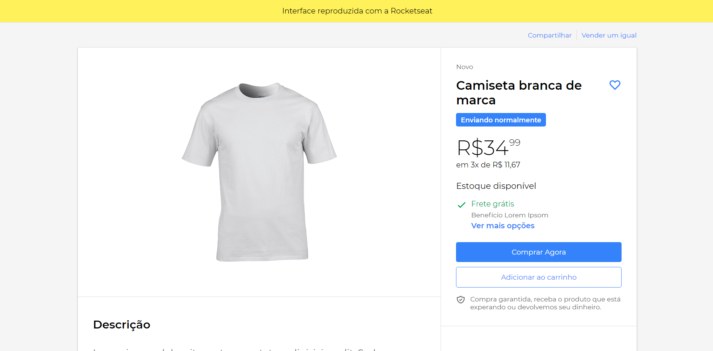

<p align="center">

  <a href="LICENSE" style="text-decoration: none">
    
  </a>

  <a href="https://github.com/wesleyfeitosa/clone-mercadolivre/issues" style="text-decoration: none">
    
  </a>

  <a href="#" style="text-decoration: none">
    
  </a>

  <a href="https://github.com/wesleyfeitosa/clone-mercadolivre/stargazers" style="text-decoration: none">
    
  </a>

</p>

## :rocket: Technologies

This project was developed with the following technologies:

- [React](https://reactjs.org)
- [Typescript](https://www.typescriptlang.org/)
- [Styled-components](https://styled-components.com/)

## 💻 Project

This project is a clone of the free market product page, it was done entirely for the purpose of learning.



## 🤔 How to contribute

- Fork this repository;
- Create a branch with your feature: `git checkout -b my-feature`;
- Commit your changes: `git commit -m 'feat: My new feature'`;
- Push to your branch: `git push origin my-feature`.

After the merge of your pull request is done, you can delete your branch.

## 🔖 How to run

#### Cloning the project
```sh
git clone https://github.com/wesleyfeitosa/clone-mercadolivrel.git
cd clone-mercadolivre
yarn install
```

#### Starting Front-end
```sh
yarn start
```

## :memo: License

This project is under the MIT license. See the file [LICENSE](LICENSE) for more details.

---

Made with 💜 by Wesley Feitosa :wave:
